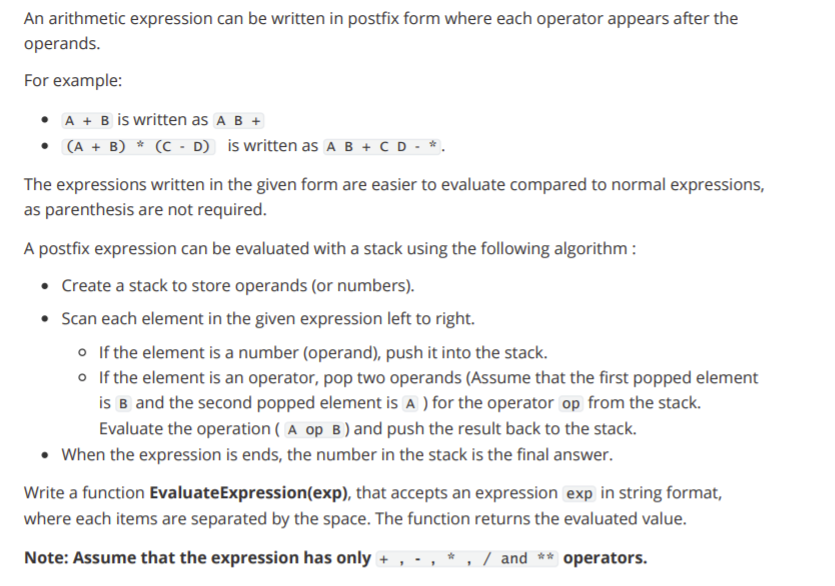

# GrPA 1

## Question

A restaurant always prepares dishes with the most orders before others with a lesser number of orders. Each dish in the restaurant menu has a unique integer ID. The restaurant receives n orders in a particular time period. The task is to find out the order of dish IDs according to which the restaurant will prepare them. Assume that restaurant has the following unique dish IDs in its menu:

[1001, 1002, 1003, 1004, 1005, 1006, 1007, 1008, 1009]

Write a function DishPrepareOrder(order_list) that accepts order_list in the form of a list of dish IDs and returns a list of dish IDs in the order in which the restaurant will prepare them. If two or more dishes have the same number of orders, then the dish which has a smaller ID value will be prepared first.

**Sample Input:** 

```
[1004,1003,1004,1003,1004,1005,1003,1004,1003,1002,1005,1002,1002,1001,1002,1002,1002]
```

**Sample Output:**
```
[1002, 1003, 1004, 1005, 1001]
```

## Solution

```
def insertionsort(L): #use this because it is stable sort
    n = len(L)
    if n < 1:
        return(L)
    for i in range(n):
        j = i
        while(j > 0 and L[j][1] > L[j-1][1]):
            (L[j],L[j-1]) = (L[j-1],L[j])
            j = j-1
    return(L)

def DishPrepareOrder(order_list):
    order_count = {}
    R = []
    for order in order_list:
        if order in order_count:
            order_count[order] += 1
        else:
            order_count[order] = 1
    for ID in sorted(order_count.keys()):
        R.append((ID,order_count[ID]))
    R=insertionsort(R)
    Res = []
    for tup in R:
        Res.append(tup[0])
    return Res
nums = eval(input())
print(DishPrepareOrder(nums))
```

---

# Grpa 2

## Question:


.png)

## Solution:

```
class create_stack:
  def __init__(self):
    self.stack = []
  def push(self,d):
    self.stack += [d]
  def pop(self):
    t = self.stack[-1]
    self.stack = self.stack[:-1]
    return t

def EvaluateExpression(exp):
  opt = ['+','-','*','/','**']
  stk = create_stack()
  L = exp.split(' ')
  for i in L:
    if i not in opt:
      stk.push(i)
    else:
      b = stk.pop()
      a = stk.pop()
      res = eval(a + i + b)
      stk.push(str(res))
  return stk.pop()
print(float(EvaluateExpression(input())))
```

---

# GrPA 3

## Question

Complete the below function `reverse(root)` that will reverse the linked list with the first node passed as an argument, and return the first node of the reversed list. Each node in the linked list is an object of class Node. Class Node members are described below.

Class Node:

• `value` - stored value.
• `next` - points to next node.
• `isEmpty()` - returns True if linked list is empty, False otherwise.
Note- The list is to be reversed only by changing next pointer of existing nodes. No values to be changed and no new nodes to be created.

```
# Implement this function
def reverse(root):
  # Your code goes here.
```

**Sample Input 1:**

```
64,7,28,43,3
```

**Sample Output 1:**

```
3,43,28,7,64
```
**Sample Input 2:**

```
12
```
**Sample Output 2:**

```
12
```

## Solution

```
def reverse(root):
  if (root.isEmpty()):
    return root
  temp = root
  prev = None
  while (temp):
    next, temp.next = temp.next, prev
    prev, temp = temp, next
  return prev
```