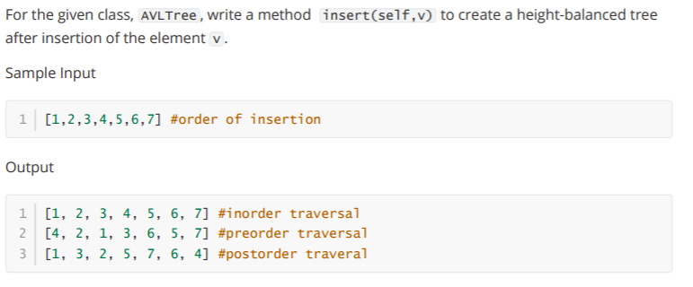
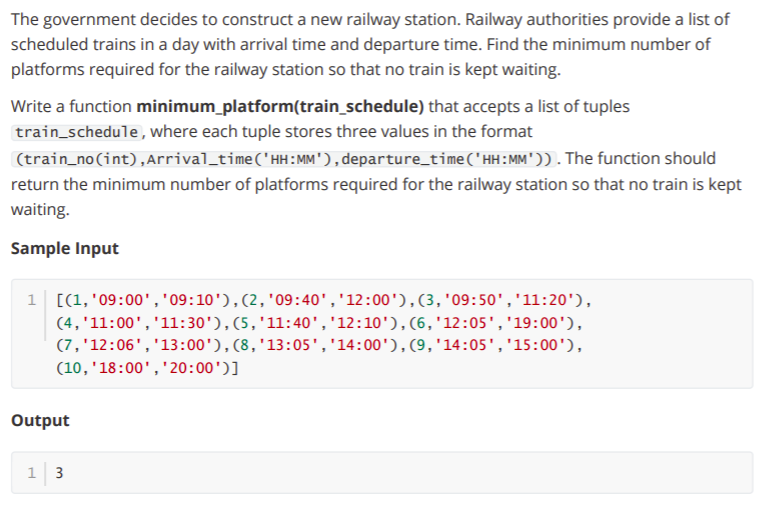
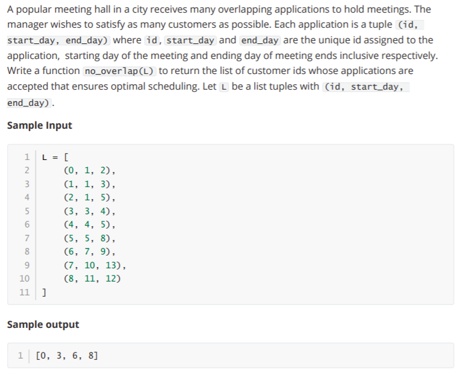

# GrPA 1

## Question



## Solution

```
class AVLTree:
    # Constructor:
    def __init__(self,initval=None):
        self.value = initval
        if self.value:
            self.left = AVLTree()
            self.right = AVLTree()
            self.height = 1
        else:
            self.left = None
            self.right = None
            self.height = 0
        return

    def isempty(self):
        return (self.value == None)

    def isleaf(self):
        return (self.value != None and self.left.isempty() and self.right.isempty())

    def leftrotate(self):
        v = self.value
        vr = self.right.value
        tl = self.left
        trl = self.right.left
        trr = self.right.right
        newleft = AVLTree(v)
        newleft.left = tl
        newleft.right = trl
        self.value = vr
        self.right = trr
        self.left = newleft
        return
    def rightrotate(self):
        v = self.value
        vl = self.left.value
        tll = self.left.left
        tlr = self.left.right
        tr = self.right
        newright = AVLTree(v)
        newright.left = tlr
        newright.right = tr
        self.right = newright
        self.value = vl
        self.left = tll
        return
    def insert(self,v):
        if self.isempty():
            self.value = v
            self.left = AVLTree()
            self.right = AVLTree()
            self.height = 1
            return        
        if self.value == v:
            return        
        if v < self.value:
            self.left.insert(v)
            self.rebalance()
            self.height = 1 + max(self.left.height, self.right.height)            
        if v > self.value:
            self.right.insert(v)
            self.rebalance()            
            self.height = 1 + max(self.left.height, self.right.height)    
                              
    def rebalance(self):
        if self.left == None:
            hl = 0
        else:
            hl = self.left.height
        if self.right == None:
            hr = 0
        else:
            hr = self.right.height                        
        if  hl - hr > 1:
            if self.left.left.height > self.left.right.height:
                self.rightrotate()
            if self.left.left.height < self.left.right.height:
                self.left.leftrotate()
                self.rightrotate()
            self.updateheight()        
        if  hl - hr < -1:
            if self.right.left.height < self.right.right.height:
                self.leftrotate()
            if self.right.left.height > self.left.right.height:
                self.right.rightrotate()
                self.leftrotate()
            self.updateheight()
            
    def updateheight(self):
        if self.isempty():
            return
        else:
            self.left.updateheight()
            self.right.updateheight()
            self.height = 1 + max(self.left.height, self.right.height)
    def inorder(self):
        if self.isempty():
            return([])
        else:
            return(self.left.inorder()+ [self.value]+ self.right.inorder())
    def preorder(self):
        if self.isempty():
            return([])
        else:
            return([self.value] + self.left.preorder()+  self.right.preorder())
    def postorder(self):
        if self.isempty():
            return([])
        else:
            return(self.left.postorder()+ self.right.postorder() + [self.value])

A = AVLTree()
nodes = eval(input())
for i in nodes:
    A.insert(i)

print(A.inorder())
print(A.preorder())
print(A.postorder())
```

---

# GrPA 2

## Question



## Solution

```
def minimum_platform(train_schedule):
    count = 1
    train_list = []
    for (i,j,k) in train_schedule:
        train_list.append((int(j.replace(':','')),int(k.replace(':','')),i))
    train_list.sort()
    train_at_plateform = []
    for train in train_list:        
        
        t = len(train_at_plateform)-1
        while t >= 0:
            if train[0] > train_at_plateform[t][1]:
                train_at_plateform.pop(t)
            t = t-1        
        t = len(train_at_plateform)-1
        while t >= 0:
            if train[0] < train_at_plateform[t][1]:
                t = t - 1        
            elif train[1] > train_at_plateform[t][1]:
                train_at_plateform.pop(t)
                t = t - 1                
        train_at_plateform.append(train)                    
        if len(train_at_plateform) > count:
            count = len(train_at_plateform)
    return count

schedule = eval(input())           
print(minimum_platform(schedule))
```

---

# GrPA 3

## Question



## Solution

```
def tuplesort(L, index):
    L_ = []
    for t in L:
        L_.append(t[index:index+1] + t[:index] + t[index+1:])
    L_.sort()

    L__ = []
    for t in L_:
        L__.append(t[1:index+1] + t[0:1] + t[index+1:])
    return L__

def no_overlap(L):
    sortedL = tuplesort(L, 2)
    accepted = [sortedL[0][0]]
    for i, s, f in sortedL[1:]:
        if s > L[accepted[-1]][2]:
            accepted.append(i)
    return accepted
```