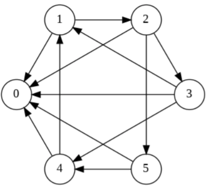
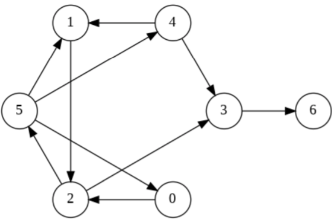
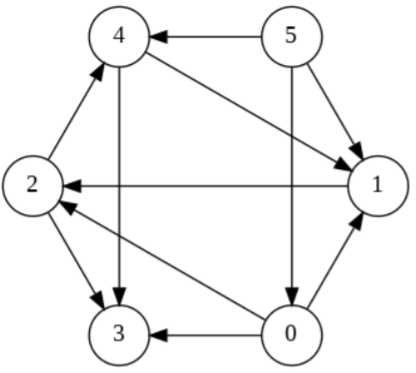
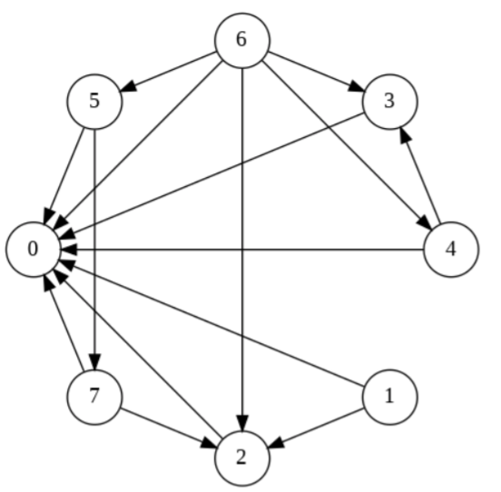
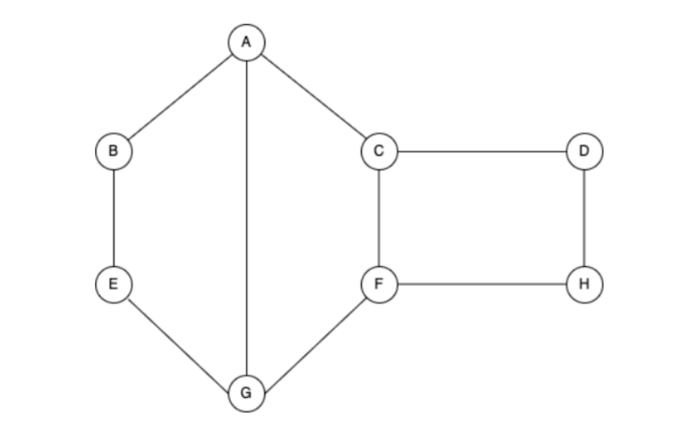
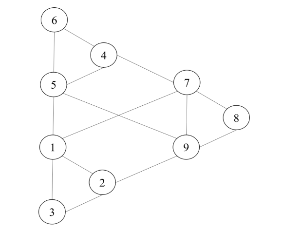

## Graded Assignment 4

1) An undireted graph has 6 vertices. If it has exactly 3 connected components, what is the maximum number of edges this graph can have? (Type: Numeric)

**Ans:- 6**

---

2) Consider a connected undirected graph *G  = (V, E)* with |*V*| = 8 vertices and |*E*| = 10 edges. What is the minimum number of edges that must be added to *G* to make it a complete graph? (Type: Numeric)

**Ans:- 18**

---

3) A Depth-First Search (DFS) is performed on a connected undirected graph with *V* = 10 vertices and *E* = 12 edges. What is the number of tree edges in the DFS forest? (Type: Numeric)

**Ans:- 9**

---

4) Which of the following statements are **true** regarding a topological sort of a Directed Acyclic Graph (DAG)? [MSQ]

1. A DAG can have multiple valid topological sorts.  
1. Every DAG has at least one vertex with an in-degree of 0. 
1. If there is an edge from vertex u to vertex v, then u appears before v in any topological sort.  
1. Topological sort can be applied to directed graphs containing cycles.

**Feedback:** 

(A) **True**. If there are multiple vertices with an in-degree of 0 at any step, or if the graph has multiple valid "next" choices, then multiple valid topological orderings can exist. For example, in a graph with edges A->B and A->C, both A,B,C and A,C,B are valid.
(B) **True**. If a non-empty DAG had no vertex with an in-degree of 0, it would imply that every vertex has at least one incoming edge, which would eventually lead to a cycle, contradicting the definition of a DAG.
(C) **True**. This is the fundamental property of a topological sort: all directed edges must point from a vertex earlier in the ordering to a vertex later in the ordering.
(D) **False**. Topological sort is only defined for Directed Acyclic Graphs (DAGs). If a graph contains a cycle, it's impossible to linearize all vertices such that all edges point forward, as there would be a cyclic dependency.

**Ans:- 1, 2, 3.**

1. A DAG can have multiple valid topological sorts.  
1. Every DAG has at least one vertex with an in-degree of 0. 
1. If there is an edge from vertex u to vertex v, then u appears before v in any topological sort.  

---

5) A directed graph has 5 vertices. If it is guaranteed to have a unique topological sort, what is the maximum number of edges this graph can have? (Type: Numeric)

**Ans:- 4**

---

6) Which of the following graph can be sorted using topological sort?

1. 
1. 
1. 
1. 

**Feedback: Topological sort works only for Directed Acyclic graph. Option (a) and (b) have directed cycle and there is no vertex with indegree 0 and option (c) have directed cycle in the graph. Hence option (d) is correct.**

**Ans:- 4.**

---

7) Consider a directed graph G with 90 edges with the least number of vertices possible. What will be the number of vertices in graph G .

1. 8
1. 9
1. 10
1. 11

**Feedback: For directed graph with N vertices N(N-1) edges are possible Hence 10 is the number of vertices.**

**Ans:- 10**

---

8) We want to represent the graph G mentioned in previous question, in memory either as an Adjacency matrix or Adjacency list. Assume that each cell in the adjacency matrix takes 4 bytes of memory and each edge representation in the adjacency list occupies 8 bytes of memory(you can ignore all other factors that occupy memory). What will be the amount of memory required to represent graph G using Adjacency matrix and Adjacency List respectively? (This is follow up question for question 7)

1. 324 bytes, 720 bytes
1. 324 bytes, 1440 bytes
1. 400 bytes, 720 bytes
1. 400 bytes, 1440 bytes

**Feedback:**

With minimum 10 vertices we can have a directed graph with 90 edges.

Adjacency matrix = 10 x 10 x 4 = 400 bytes

Adjacency list = 10 x 9 x 8 = 720 bytes.

Other options are calculation for 9 vertices.

**Ans:- 3. 400 bytes, 720 bytes**

---

9) 
1 point
I: BFS can be used to find the shortest path between two vertices in an unweighted graph.
II: DFS can be used to find the shortest path between two vertices in an unweighted graph.
Which of the following options is correct?

1. Both I and II are true
1. I is true, II is false
1. I is false, II is true
1. Both I, II are false

**Feedback: Only BFS is used to traverse in an unweighted graph to find the shortest path between vertices in terms of the number of edges.**

**Ans:- 2. I is true, II is false**

---

10) An undirected graph G has 17 vertices. The sum of the degrees of all the vertices in G is D. The number of vertices of even degree in G is K, Which of these values are possible for D and K?

1. D = 42, K = 9
1. D = 41, K = 9
1. D = 42, K = 10
1. D = 41, K = 10

**Feedback:**

Sum of degree of all vertices in undirected graph =2*number of edges hence it will be even number so D=42 if D=42 then number of edges is 21. We know that undirected graph has even number of odd degree vertices .

17=number of odd degree vertices +number of even degree vertices

Hence 10 can't be possible other wise 17-10=7 and odd degree can't be 7 hence K should be 9

**Ans:- 1. D = 42, K = 9**

---

11) A king’s summer house is being rewired. The house has 11 rooms. To avoid wires getting entangled and creating short circuits, the electricians have been asked to observe the following rules. 

* Room 1 must be rewired before rooms 3 and 4. 
* Room 2 must be rewired before room 6. 
* Room 3 must be rewired before room 5. 
* Room 5 must be rewired before rooms 8 and 9. 
* Room 6 must be rewired before room 7. 
* Room 7 must be rewired before room 5. 
* Room 8 must be rewired before room 10. 
* Room 9 must be rewired before room 11. 

It takes one full day to rewire a room. There are enough electricians to rewire as many rooms as can be rewired in parallel, keeping in mind the constraints above. What is the minimum number of days required to complete the job?

1. 4
1. 5
1. 6
1. 8

**Ans:- 3. 6**

---

12) We have an undirected graph `G` with `7` vertices. We write down the degrees of all vertices in `G` in descending order. Which of the following is a possible listing of the degrees?

1. , 6, 6, 5, 4, 1, 1
1. 6, 6, 6, 3, 2, 2, 1
1. 5, 3, 3, 2, 2, 1, 1
1. 5, 3, 3, 3, 3, 2, 1

**Ans:- 4. 5, 3, 3, 3, 3, 2, 1**

---

13) Consider the following graph:

If we run Breadth First Search(BFS) on the given graph starting from vertex A , which of the following is the order of visiting the nodes?

***Note**: Assume that when a node has multiple neighbours, BFS visits them alphabetically.*

1. A B C G E F D H
1. A B C G E D F H
1. A B C E F G D H
1. A B C G D E F H

---

14) Consider a simple undirected connected graph G with **65** edges with the least number of vertices possible. What will be the number of vertices in graph G? (Type: Numeric)

**Ans:- 12**

---

15) Consider the following graph:

How many connected components remain the above graph if the edges (5,9), (4,7), (1,7), (1,5) and (2,9) are deleted ? (Type: Numeric)

**Ans:- 4**