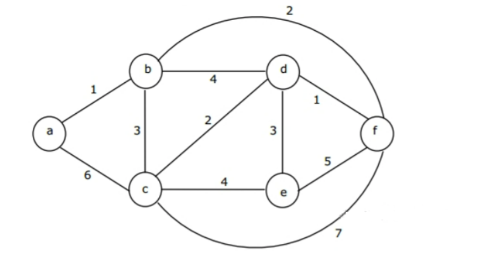
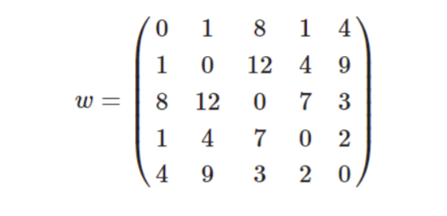
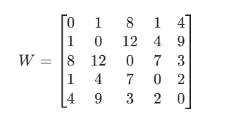
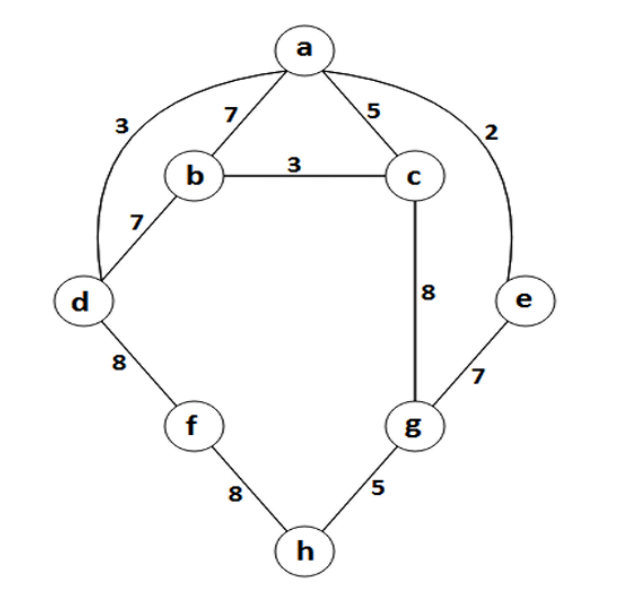
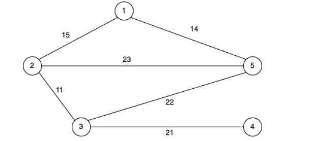
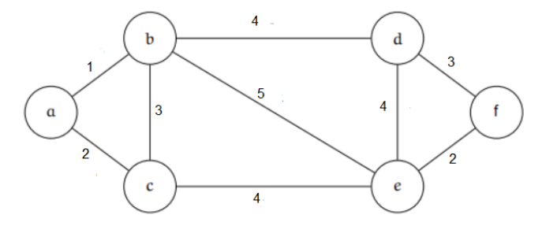

## Graded Assignment 5

1) At each step of Dijkstra's algorithm, after a vertex has been processed, how does the algorithm determine which unvisited vertex to process next? 

1. It selects the unvisited vertex with the highest number of direct neighbours.
1. It picks the unvisited vertex that has the smallest current shortest distance from the source.
1. It randomly chooses an unvisited vertex from the remaining set.
1. It prioritizes the unvisited vertex that was most recently added to the graph.

**Feedback:**

Dijkstra's algorithm is a **greedy algorithm** that solves the **single-source shortest path** problem for graphs with **non-negative edge weights**. Here's how it works:

  ● At each step, Dijkstra's algorithm maintains a **set of visited (processed) vertices** and a **priority queue (or similar structure)** holding unvisited vertices with their **tentative shortest distance** from the source. 

  ● Among all unvisited vertices, the algorithm always chooses the **vertex with the smallest current known distance** from the source. This is a key part of the greedy strategy — choosing the "best local option" at each step. 

  ● Once a vertex is chosen, the algorithm **relaxes** all its neighboring edges — updating their distances if a shorter path is found via the selected vertex.

**Ans:- 2. It picks the unvisited vertex that has the smallest current shortest distance from the source.**

---

2) Which of the following statements correctly describes how the Bellman-Ford algorithm detects the presence of a negative cycle reachable from the source? Consider that V is the number of vertices in the graph. 

1. f, after V−1 passes, any distance value is still infinity.
1. If, during the (V−1)th pass, any edge relaxation results in a distance update.
1. If, during a Vth pass over all edges, any distance value can still be improved (i.e., an edge relaxation occurs).
1. If the sum of weights along any path becomes negative.

**Ans:- 3. If, during a Vth pass over all edges, any distance value can still be improved (i.e., an edge relaxation occurs).**

---

3) A graph has 4 vertices (V1, V2, V3, V4) and the following edges:

- V1 → V2 (weight = 2)
- V2 → V3 (weight = -3)
- V3 → V1 (weight = 0)
- V1 → V4 (weight = 5)

If Bellman-Ford starts from V1, after running the algorithm for all necessary passes, how many vertices will have their shortest distance updated in the final (4-th) pass used for negative cycle detection? (Type: Numeric)

**Ans:- 3**

---

4) Consider any connected graph with 4 vertices and 6 edges, where all edge weights are distinct. In such a graph, the three edges with the smallest weights will always be part of its Minimum Spanning Tree (MST).

- True
- False

**Ans:- False**

---

5) A graph can have a unique Minimum Spanning Tree (MST) only if all its edge weights are distinct

- True
- False

**Ans:- False**

---

6) Suppose we run Prin's algorithm and Kruskal's algorithm on a graph G and these two algorithms produce minimum-cost spanning trees *Tp* and *Tk*, respectively.

(i) *Tp* may be different from *Tk* if some pair of edges in G have the same weight.
(ii) *Tp* is always the same as *Tk* if all edges in G have distinct weights.

Which of the following is true?

1. Only (I) is correct.
1. Only (II) is correct.
1. Both (I) and (II) are correct.
1. Both (I) and (II) are incorrect.

**Feedback: If some pair of edges in G have the same weight, then selection of edge can be different in Prim's and Kruskal's algorithm because of that minimum-cost spanning tree can be different with the same cost. If all edges in G have distinct weights, then always the same edges will be selected by both algorithm for MST. Hence, third option is correct**

**Ans:- 3. Both (I) and (II) are correct.**

---

7) Consider the graph shown below.



Which one of the following can be the sequence of edges added, in that order, to create a minimum spanning tree using Kruskal’s algorithm? [MSQ]

1. (a,b) (d,f) (b,f) (d,c) (d,e)
1. (a,b) (d,f) (d,c) (b,f) (d,e)
1. (d,f) (a,b) (d,c) (b,f) (d,e)
1. (d,f) (a,b) (b,f) (d,e) (b,c)
1. (d,f) (a,b) (b,f) (d,c) (d,e)
1. (d,f) (a,b) (b,f) (d,c) (b,c)

**Feedback: Given graph have many pair of edge with same weights, because of that more than one MST are possible based on the selection of edges. All options are representing correct sequence of edge of MST for given graph.**

**Ans:- 1, 2, 3, 5.**

1. (a,b) (d,f) (b,f) (d,c) (d,e)
2) (a,b) (d,f) (d,c) (b,f) (d,e)
3. (d,f) (a,b) (d,c) (b,f) (d,e)
5) (d,f) (a,b) (b,f) (d,c) (d,e)

---

8) Consider the given weighted adjacency matrix w for a complete undirected graph with vertex set {0,1,2,3,4}. Where *w[i][j],i≠j* in the matrix is the weight of the edge (*i,j*).



What is the weight of the minimum spanning tree for the given graph? (Type: Numeric)

**Ans:- 7**

---

9) Which of the following statement(s) is/are true about the spanning tree of a connected graph?

1. A spanning tree is a connected acyclic graph.
1. A spanning tree for an n vertex graph has exactly n-1 edges.
1. Adding an edge to a spanning tree must create a cycle.
1. In a spanning tree, every pair of nodes is connected by a unique path

**Ans:- 1, 2, 3, 4.**

1) A spanning tree is a connected acyclic graph.
1) A spanning tree for an n vertex graph has exactly n-1 edges.
1) Adding an edge to a spanning tree must create a cycle.
1) In a spanning tree, every pair of nodes is connected by a unique path

---

10. Consider the following weighted adjacency list **WList** for a directed and connected graph. What will be the path weight of the shortest path from 1 to 3? (Type: Numeric)

```
WList = {
    #source: [(destination, weight),..]
    1:[(2,10),(8,8)]
    2:[(6,2)]
    3:[(2,1),(4,1)]
    4:[(5,3)]
    5:[(6,-1)]
    6:[(3,-2)]
    7:[(2,-4),(6,-1)]
    8:[(7,1)]
}
```

**Ans:- 5**

---

11) Consider a complete undirected graph with vertex set {0, 1, 2, 3, 4}. Every entry W[i][j] where i ≠ j in the matrix W below is the weight of the edge from vertex i to vertex j.



What is the minimum possible weight of a path P from vertex 4 to vertex 1 in this graph? (Type: Numeric)

**Ans:- 4**

---

12) In the given graph, if we try to find the shortest path from node **a** to all other nodes usng Dijkstra's algorithm, in what order do the nodes get included in the visited set?



1. a e d c b h f g
1. a e d c b g f h
1. a e d b c g f h
1. a e c d b g f h

**Ans:- 2. a e d c b g f h**

---

13) Consider the given graph below:



Which of the following is the correct sequence of edges added to the minimum spanning tree when **Prim's algorithm** is applied on this graph with 5 as the source vertex?

1. [(5,1),(3,2),(1,2),(3,4)]
1. [(5,1),(1,2),(2,3),(3,4)]
1. [(5,1),(3,4),(3,2),(2,1)]
1. [(5,1),(3,2),(3,4),(2,1)]

**Ans:- 2. [(5,1),(1,2),(2,3),(3,4)]**

---

14) In the context of the **Floyd-Warshall algorithm**, what does it mean if the distance matrix has a negative value in its diagonal?

1. The graph has a negative-weight cycle.
1. The graph has negative-weight on edge but no negative-weight cycle.
1. The graph is acyclic.
1. The graph has a disconnected component.

**Ans:- 1. The graph has a negative-weight cycle.**

---

15) Consider the graph ***G*** given below.



Let denote α the number of minimum spanning trees of G and β denote the weight of such a minimum spanning tree. The value of α + β is ___________. (Type: Numeric)

**Ans:- 14**