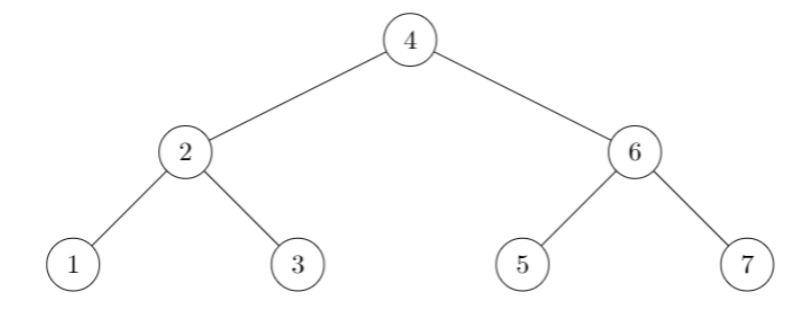
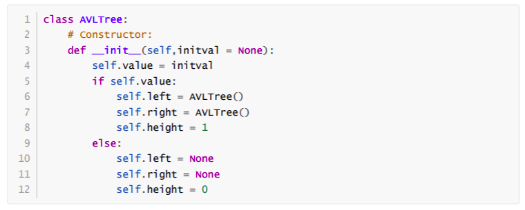
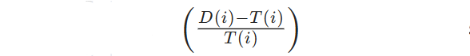
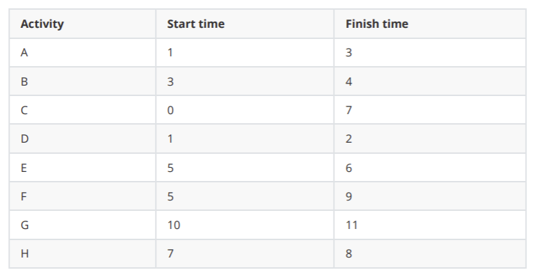
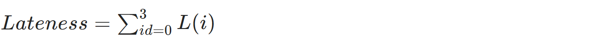
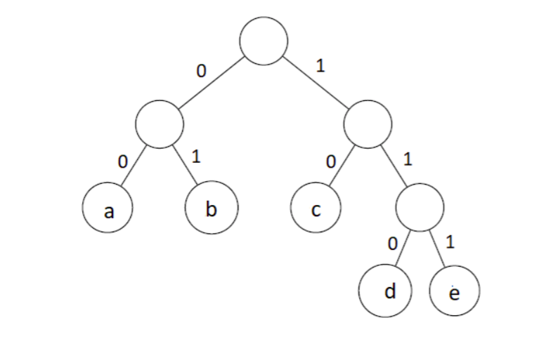
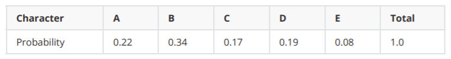
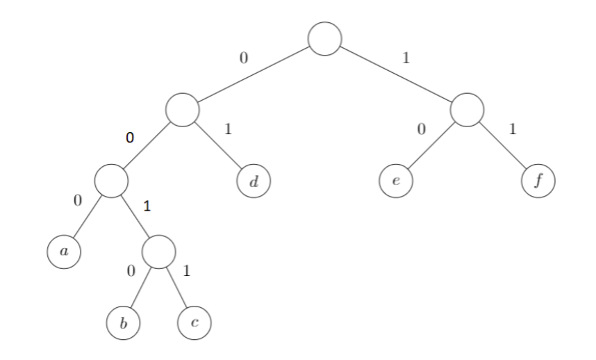

## Graded Assignment 7

1)

Which of the following insertion order of data items will generate the above AVL tree? [MSQ]

1. 1,2,3,4,5,6,7
1. 3,2,6,1,5,7,4
1. 7,6,5,4,3,2,1
1. 5,3,6,2,4,7,1

**Feedback:**

Insert nodes one by one in a given sequence according to the binary search rule and update the slope or balance factor(absolute difference between left height and right height) of each mode. If at any time the slop value of any node is more than 1 then apply left or right rotation to balance the tree.

Create the AVL tree for given sequences, after that, you can observe options (a) and (c) will generate the given AVL tree.

**Ans:- 1,3.**

1) 1,2,3,4,5,6,7
3. 7,6,5,4,3,2,1

---

2)

For the above class **AVLTree**, if the leaf node has height 1, then which of the following options will compute the height of all nodes in the tree? Consider that **self** is referencing the root node of the tree.

1.
.png)

2.
.png)

3.
.png)

4.
.png)

**Ans:- 3**

.png)

---

3) A manager claims scheduling jobs based on the slack time to time taken ratio

is optimum. His strategy is to complete the job which has the least slack to the time taken ratio. Choose the counter-example to prove the strategy is not optimum.

1. 
.png)

2. 
.png)

3. 
.png)

4.
.png)

**Feedback:**

In option (d), the slack time to time taken ratio for job 1 is less than compared to job 2, if we follow this order (job 1 then job 2) then the lateness of job 2 will be 4, but if we follow the reverse order (job 2 then job 1) then the lateness of both jobs will be 0. So we can say that this type of scheduling strategy is not optimum.

**Ans:- 4.**
.png)

---

4)

In the Activity Selection Problem, each activity i has a start time ***Si*** and a finish time ***Fi*** where ***Si<Fi***. Two or more activities can not perform simultaneously. Activity **i** and **j** are said to be non-conflicting if _____ .

1. ***Si <= Fj***
1. ***Sj <= Fi***
1. ***Si >= Fj or Sj >= Fi***
1. ***Si <= Sj and Fi <= Fj***

**Ans:- 3.**

3. ***Si >= Fj or Sj >= Fi***

---

5) In the table below, we have 8 activities with the corresponding start and finish times, It might not be possible to complete all the activities since their time frame can conflict. For example, if any activity starts at time 0 and finishes at time 4, then other activities can not start before 4. It can be started at 4 or afterwards. What is the maximum number of activities which can be performed without conflict? (Type: Numeric)

**Ans:- `5`**

---

6) A machine has to rest for an hour mandatorily after every 5 hours of continuous work but the machine can take rest for an hour before completion of 5 hours and become available for next 5 hours. What will be value of lateness of the given list of jobs in an optimal sequence?

.png)
.png)

**Ans:- `3`**

---

7) Which of the following is/are true about Huffman code algorithm?

1. Huffman code algorithm generates prefix code.
1. In an optimal Huffman tree, if leaf labelled **x** is at depth smaller than leaf labelled **y**, then **frequency(x)** <= **frequency(y)**
1. It is based on a greedy approach.
1. It has the complexity of *O(k log k)wherekisthenumberofuniquecharacters.*

---

8) 

We received a message 10010000010001110111100011010 encoded using Huffman coding of a,b,c,d and e generated by the given Huffman tree. Which of the following is the correct decoded message for the given encoded message?

1. cbaababdebadb
1. cbaabcbdebadc
1. cbaababdecadc
1. cbaabcbedcadc

**Ans:- 3. cbaababdecadc**

---

9) An entire message is created using characters from the set S = {A,B,C,D,E}. The table of the probability of each character is given below.

A message of 1000 characters is encoded using Huffman coding. What will be the expected length of the encoded message in bits?

1. 2230
1. 2240
1. 2250
1. 2260

**Ans:- 3. 2250**

---

10) 

Consider the Huffman tree above for encoding. Which of the following is/are invalid encoding?

1. 00110110110010000
1. 111011000110011001001
1. 10101011010100000010011
1. 11001110001000101000
1. 111010111001011100011

**Ans:- 3, 4.**

3. 10101011010100000010011
4. 11001110001000101000