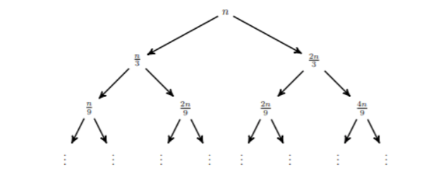
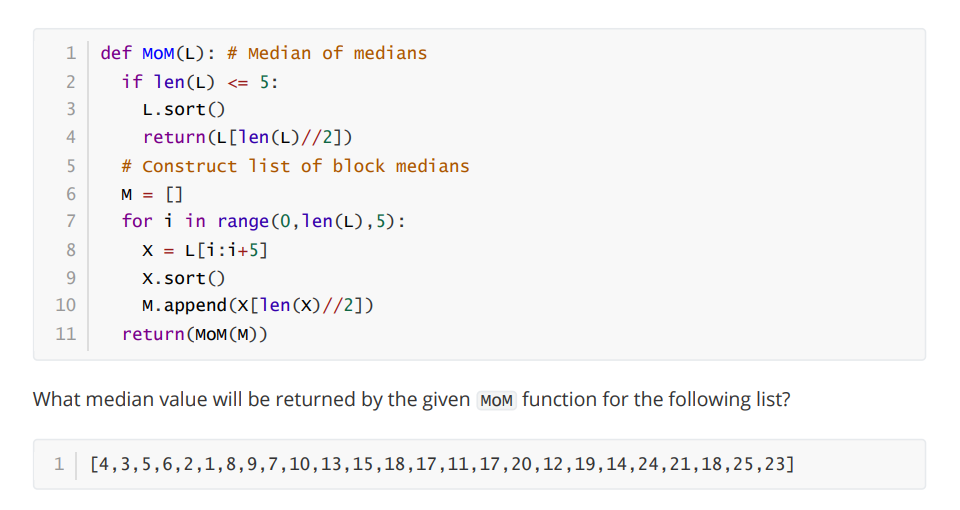
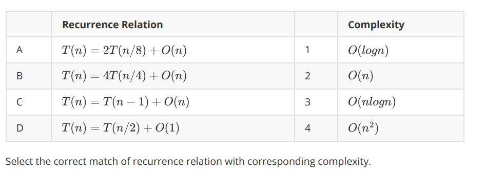
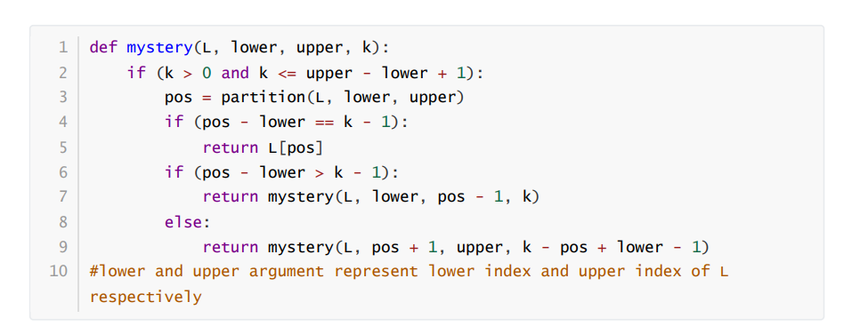

## Graded Assignment 8

1) In an array *A*, two elements *A[i]* and *A[j]* form an inversion pair, if *A[i] > A[j]* for *i < j*.

Which of the following input arrays will have maximum and minimum inversion pairs respectively?

I. Array sorted in ascending order.
II. Array sorted in descending order.

1. I and II
1. II and I
1. I and I
1. II and II

**Feedback:**

Suppose an array contains n elements. If the array is sorted in ascending order then the number of inversion pairs will be 0 and if the array is sorted in descending order then the number of inversion pair will be n(n-1)/2. Hence, option (b) is the correct answer.

**Ans:- 2. II and I**

---

**Question 2 & 3**

Consider the following strategy to solve a problem of input size *n*.

Divide the problem into 6 sub-problems, each of size *n/6*. Number of steps required to combine these 6 solutions is *2n + 12*. We apply this strategy recursively till the sub-problems can not be further divided into sub-problems.

---

2) What will be the nearest upper bound for the above algorithm?

1. *O(n^2)*
1. *O(n^6)*
1. *O(n log n)*
1. *O(n)*

**Ans:- 3. *O(n log n)***

---

3) f we divide the problem into 4 sub-problems of size *n/2* and number of steps required to combine the solutions is *15* using some optimizations, what will be the nearest upper bound of this algorithm?

1. *O(n^2)*
1. *O(n^4)*
1. *O(log n)*
1. *O(n)*

**Ans:- *O(n^2)***

---

Question 4 & 5

---

4) Which of the following options describe the recurrence relation that will give the above recurrence tree, if the cost to combine solutions at each level is equal to 2n and the cost to compute the solution of sub-problem at leaf nodes is **Θ(1)**?

1. T(n)=T(n/3)+T(2n/3)+2n
1. T(n)=T(n/3)+T(2n/3)+n
1. T(n)=3T(n/3)+2n
1. T(n)=T(n/3)+T(2n/3)+O(n)

**Ans:- 1, 4.**

1) T(n)=T(n/3)+T(2n/3)+2n
4. T(n)=T(n/3)+T(2n/3)+O(n)

---

5) If *O(f(n))* is the upper bound for the above recurrence relation. What is the value of *f(n)*.

1. *log n*
1. *n log n*
1. *n^2*
1. *n^(3/2) log n*

**Ans:- 2. *n log n***

---

6) In an array A , two elements A[i] and A[j] form an inversion pair, if A[i] > A[j] for i < j .

The maximum number of inversion pairs possible in an integer array A of size 10 is ___. (Type: Numeric)

**Ans:- 45**

---

7) In a list L, two elements L[i] and L[j] form an inversion if L[i] > L[j] and i < j.

The total number of inversions for L = [ 2, 7, 6, 1, 5 ] is___. (Type: Numeric)

**Ans:- 6**

---

8) Consider the following function MoM

(Type: Numeric)

**Ans:- 15**

---

9)

1. A-2, B-4, C-3, D-1
1. A-2, B-3, C-4, D-1
1. A-2, B-3, C-1, D-4
1. A-3, B-2, C-4, D-1

**Ans:- 2. A-2, B-3, C-4, D-1**

---

10) Consider the following function that takes a list `L` of distinct integers and an integer k (*1 ≤ k ≤ len(L)*)

In line 3, partition function treats the first element of `L` as a pivot and rearranges the list so that all elements less than or equal to the pivot are in the left part of the list, and all elements greater than the pivot are in the right part. In addition, it moves the pivot so that the pivot is the last element of the left part. The function returns the index of pivot in the list.

What does function mystery return?

1. The smallest value in L that is greater than k .
1. The largest value in L that is less than or equal to k .
1. The kth largest element in L.
1. The kth smallest element in L.

**Ans:- 4. The kth smallest element in L.**