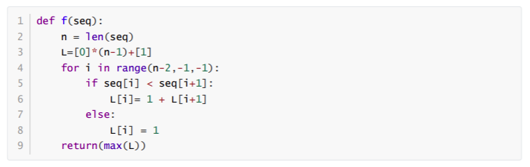
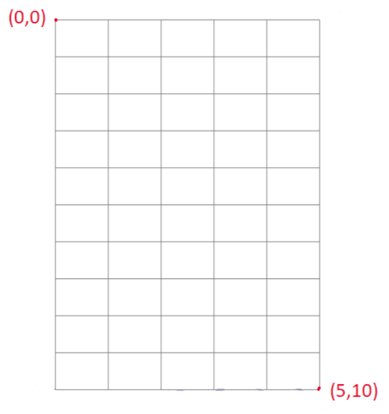
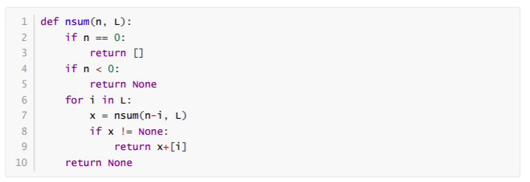
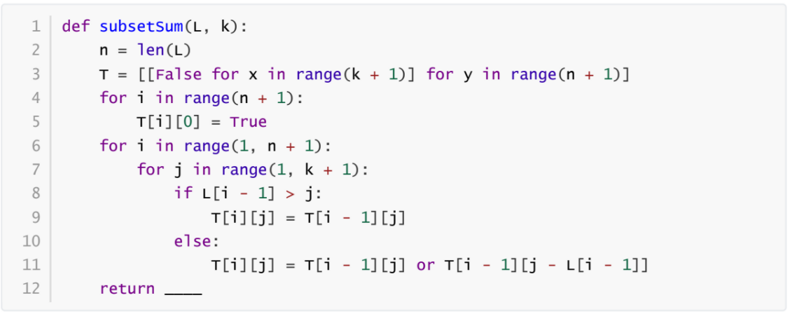

## Graded Assignment 9

1) Consider product of three matrices A, B and C having size p X q , q X r and r X S respectively. Which of the following statements is/are true? [MSQ]

1. Computing (AB)C and A(BC) both always take equal time.
1. Computing (AB)C and A(BC) both take equal time if p = q = r = s.
1. If (1/q + 1/s) < (1/p + 1/r) then (AB)C takes less time than A(BC).
1. (AB)C takes pr(q + s) steps to compute.
1. (AB)C takes less time than A(BC) if (p + q) > (r + s).

**Ans:- 2, 3, 4.**

2. Computing (AB)C and A(BC) both take equal time if p = q = r = s.
3) If (1/q + 1/s) < (1/p + 1/r) then (AB)C takes less time than A(BC).
4. (AB)C takes pr(q + s) steps to compute.

---

2) Consider four matrices ***M1, M2, M3*** and ***M4***, and of dimension p×q, q×r, r×s, and s×t respectively, where p,q,r and s are distinct values. In How many ways can we evaluate the product of ***M1, M2, M3*** and ***M4***​, and if each step consist of multiplying two matrices?

1. 3
1. 5
1. 7
1. 9

**Ans:- 2. 5**

---

3) Consider the following function **`f(seq)`**, where seq is a list of integers.

Which of the following statements is/are true ?

1. The algorithm uses the divide and conquer paradigm.
1. The function returns the length of the longest contiguous increasing sequence of numbers in the list.
1. The function takes O(n) to return the output.
1. The function returns the length of the longest increasing subsequence of the number in the list.
1. The algorithm uses the dynamic programming paradigm.

**Ans:- 2, 3, 4.**

2. The function returns the length of the longest contiguous increasing sequence of numbers in the list.
3) The function takes O(n) to return the output.
4. The algorithm uses the dynamic programming paradigm.

---

4) Which of the following statements is/are true about the edit distance problem?

1. It can be solved using the dynamic programming method.
1. It can be solved using dynamic programming in O(m+n) time, where m and n are sizes of two strings.
1. The edit distance will be zero only when the two strings are equal.
1. The maximum edit distance between the two strings is equal to the length of the larger string.

**Ans:- 1, 3, 4.**

1. It can be solved using the dynamic programming method.
3) The edit distance will be zero only when the two strings are equal.
4. The maximum edit distance between the two strings is equal to the length of the larger string.

---

5) What is the length of the longest common subsequence of strings ABCBDABACD and BDCABADCD?

1. 3
1. 5
1. 6
1. 7

**Ans:- 4. 7**

---

6) Consider the following grid.

How many unique paths are available from (0,0) to (5,10)? One condition is that you can only travel one step right or two-step down at a time. (Type: Numeric)

**Ans:- 252**

---

7) The number *n* is to be created by adding the elements(one element can be used more than one time) of a list of positive integers *L* of length *m*.

What will be the asymptotic complexity of the above recursive function without and with memoization respectively?

1. *O(m^n), O(mn)*
1. *O(2^n), O(n^2)*
1. *O(n^m), O(n)*
1. *O(2^(m+n)), O(m+n)*

**Ans:- 1. *O(m^n), O(mn)***

---

Questions 8 to 10 are based on the common theme

The subset sum problem is defined as follows. Given a list L of n non-negative integers and a value k , determine if there is a subset of elements from the list L whose sum is equal to k . Consider the following solution code where T is a 2-dimensional Boolean array, with n + 1 rows and k + 1 columns. T[i][j] , 1 ≤ i ≤ n , 1 ≤ j ≤ k is True , if and only if there is a subset of {a1, a2, ..., ai} whose sum is equal to j .

---

8) In the given code, which entry of T should be returned? If True , it implies that there is a subset of elements whose sum is equal to k .

1. T[1][k]
1. T[n][k]
1. T[k][1]
1. T[0][k]

**Ans:- 2. T[n][k]**

---

9) Function ***`subsetSum()`*** is an example of:

1. A greedy algorithm
1. A dynamic programming algorithm
1. A divide and conquer algorithm
1. None of these

**Ans:- 2. A dynamic programming algorithm**

---

10) What is the time complexity of function ***`subsetSum()`***?

1. *O(n^2)*
1. *O(n log n)*
1. *O(n + k)*
1. *O(nk)*

**Ans:- 4. *O(nk)***