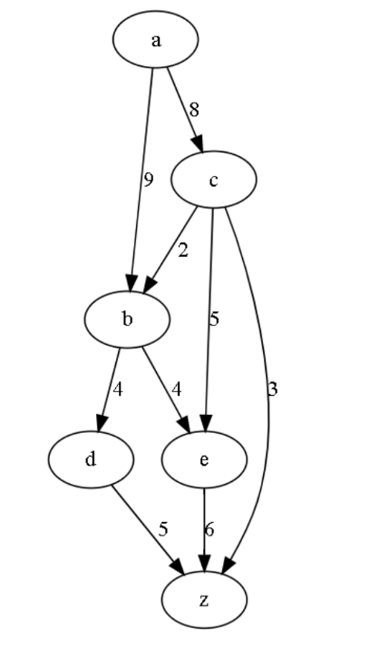
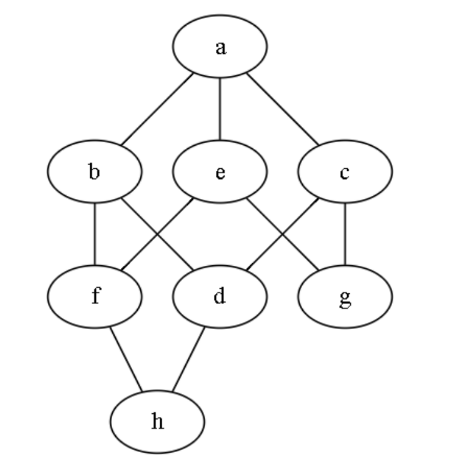
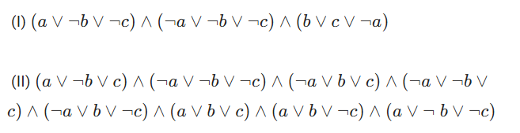

## Graded Assignment 11

1) Solve the following linear programming problem by graphical method. Find out the correct vertex that minimize the objective function?

Minimize *Z=20x+50y* subject to constraints:

- x+2y≥10
- 3x+4y≤24
- x≥0,y≥0

1. (8,0)
1. (0,6)
1. (4,3)
1. (10,0)

**Ans:- 3. (4,3)**

---

2) A plant manufacture produces two types of products A and B and sells them at a profit of Rs. 5 per item on type A and Rs. 3 per item on type B. Each product is processed on two machines G and H. One item of type A requires one minute of processing time on G and two minutes on H; One item of type B requires one minute on G and one minute on H. Machine G is available for not more than 5 hours 40 minutes, while machine H is available for 7 hours 20 minutes during any working day.

Find the formulation of LPP to Maximize the total profit?

1. Let X1 be the number of item produced of type A and X2 be the number of item produced of type B.

Maximize: *Z = 5X1 + 3X2*

- *X1 + X2 ≤ 340*
- *2X1 + X2 ≤ 440*
- *X1 ≥ 0, X2 > 0*

2. Let X1 be the number of products of type A and X2 be the number of products of type B.

Maximize: *Z = 5X1 + 3X2*

- *X1 + 2X2 ≤ 340*
- *X1 + X2 ≤ 440*
- *X1 > 0 ,X2 > 0*

3. Let X1 be the number of products of type A and X2 be the number of products of type B.

Maximize: *Z = 340X1 + 440X2*

- *X1 + 2X2 ≤ 5*
- *X1 + X2 ≤ 3*
- *X1 ≥ 0, X2 > 0*

4. Let X1 is the processing hour on machine of type G and
X2 is the processing hour on machine of type H.

Maximize: *Z = 340X1 + 440X2*

- *X1 + X2 ≤ 5*
- *2X1 + X2 ≤ 3*
- *X1 ≥ 0, X2 ≥ 0*

**Ans:- 1.**

1. Let X1 be the number of item produced of type A and X2 be the number of item produced of type B.

Maximize: *Z = 5X1 + 3X2*

- *X1 + X2 ≤ 340*
- *2X1 + X2 ≤ 440*
- *X1 ≥ 0, X2 > 0*

---

3) Find the max-flow in the following transport network, where a is the source and z is the destination?

1. 15
1. 13
1. 11
1. 16

**Ans:- 2. 13**

---

4) Find the min-cut of the transport network in question 3?

1. {(b,d), (e,z), (c,z)}
1. {(b,e), (e,z), (c,z)}
1. {(c,e), (d,z), (c,z)}
1. {(b,d), (e,z), (c,b)}

**Ans:- 1. {(b,d), (e,z), (c,z)}**

---

5) Which of the following set of vertices can make the graph Bipartite ?

1. {a, f, h, d} {b, e, c, g}
1. {a, f, d, g} {b, e, c, h}
1. {a, h, d, g} {b, e, c, f}
1. {a, b, e, c} {f, d, g, h}

**Ans:- 2. {a, f, d, g} {b, e, c, h}**

---

6) Let G be a simple graph with 25 vertices and 50 edges. The size of the minimum vertex cover of G is 10. What is the size of the maximum indepen­dent set of G ?

1. 65
1. 90
1. 15
1. 35

**Ans:- 3. 15**

---

7) Two CNF formulas are given. Choose the correct statement ?

1. (I) is unsatisfiable (II) is satisfiable
1. (I) is unsatisfiable (II) is unsatisfiable
1. (I) is satisfiable (II) is unsatisfiable
1. (I) is satisfiable (II) is satisfiable

**Ans:- 3. (I) is satisfiable (II) is unsatisfiable**

---

8) In the Ford-Fulkerson algorithm to find the maximum flow, what do all edges in the residual graph having value 0 denote?

1. Edges with flow equal to maximum capacity
1. Edges with no flow
1. Edges with partial flow
1. Edges with flow in opposite direction

**Ans:- 1. Edges with flow equal to maximum capacity**

---

9) 

1. t can be modelled as a network flow problem, where the source node is connected to every teacher node in G with capacity of n, and every subject node in G is connected to the sink node with capacity of 2n.
1. It can be modelled as a network flow problem, where the source node is connected to every teacher node in G, and every subject node in G is connected to the sink node. All edges in the network flow graph have equal capacity.
1. It can be modelled as a network flow problem, where the source node is connected to every teacher node in G with capacity of 2, and every subject node in G is connected to the sink node with capacity of 1.
1. t can be modelled as a network flow problem, where the source node is connected to every teacher node in G with capacity of 1, and every subject node in G is connected to the sink node with capacity of 2.

**Ans:- 3. It can be modelled as a network flow problem, where the source node is connected to every teacher node in G with capacity of 2, and every subject node in G is connected to the sink node with capacity of 1.**

---

10) Let C be a problem that belongs to the class NP. Then which one of the following is TRUE?

1. If C is NP-Hard, then it is NP-complete.
1. There is no polynomial time algorithm for C
1. If C can be solved in polynomial time, then P = NP
1. If every problem in NP is reducible to C in polynomial time then C is NP-complete.

**Ans:- 1, 4.**

1. If C is NP-Hard, then it is NP-complete.
4) If every problem in NP is reducible to C in polynomial time then C is NP-complete.