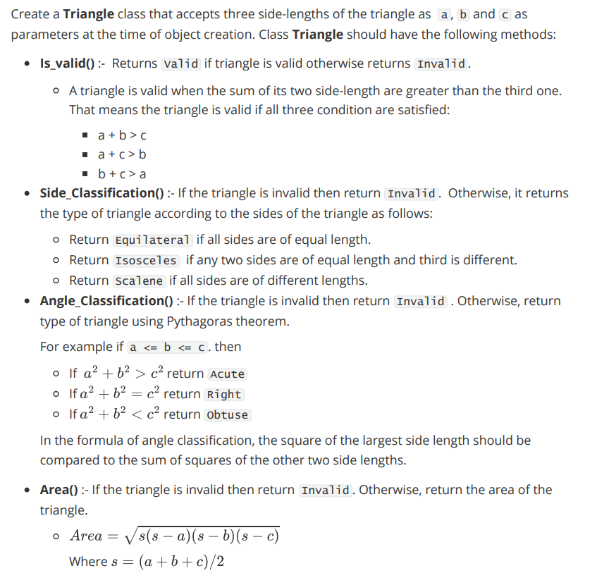

# PPA 1

## Question

Twin primes are pairs of prime numbers that differ by 2. For example (3, 5), (5, 7), and (11,13) are twin primes.

Write a function **`Twin_Primes(n, m)`** where `n` and `m` are positive integers and `n` < `m` , that returns all unique twin primes between `m` and `n` (both inclusive). The function returns a list of tuples and each tuple `(a,b)` represents one unique twin prime where `n` <= `a` < `b` <= `m`.

## Solution

```
import math

def isPrime(n):
    if `n` <= 1:
        return False
    for i in range(2,int(math.sqrt(n)+1)):
        if `n` % i == 0:
            return False
    else:
        return True

def Twin_Primes(n,m):
    pl = []
    for i in range(n, m-1):
        if isPrime(i) and isPrime(i+2):
                pl.append((i,i+2))
    return pl

n=int(input())
m=int(input())
print(sorted(Twin_Primes(n,m)))
```

---

# PPA 2

## Question



